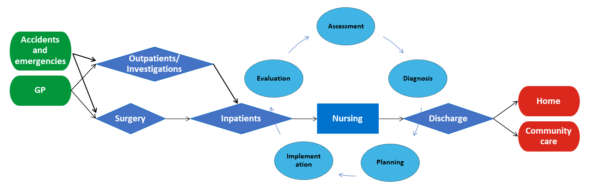
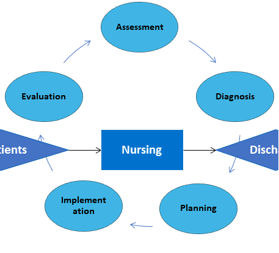
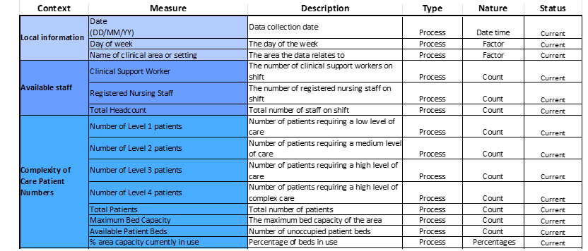
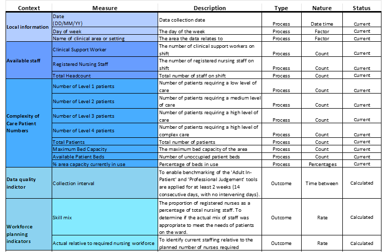
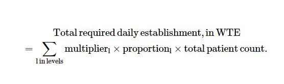

```{r setup, include=FALSE}
knitr::opts_chunk$set(echo = FALSE)
knitr::opts_knit$set(root.dir = 'C:/Users/mberm/OneDrive/Documents/Staffing_levels_for_Nursing_and_Adult_Inpatient_Care_Quality_and_Safety')
```


<br />
<br />

# Scenario

Job applicants have been asked as part of the interview process for the ‘Data and Measurement Advisory’ role with Healthcare Improvement Scotland (HIS) have been asked to analyse staffing levels data across three Clinical areas collected daily by the Senior Charge Nurse, and to present and discuss finding at hospital management meeting to discuss safe staffing levels within Hospital X. Clinical area A and B are 25 and 30 bedded adult inpatient wards respectively. Bed capacity can be over 100% due to admissions/discharges and the opening of surge beds where available.
All data, charts, images, documents and code associated with this exercise can be accessed from [gitHub](https://github.com/MaireadLBermingham/Staffing_levels_for_Nursing_and_Adult_Inpatient_Care_Quality_and_Safety.git)

<br />
<br />

# Aim

## Health and Care (Staffing) (Scotland) Act 2019
The Act was passed by the Scottish Parliament in 2019. Its implementation was paused due to the COVID-19 pandemic. All the provisions within the Act will come into force in April 2024. The Act was passed by Parliament in 2019, but implementation was paused due to the pandemic. All the provisions within the Act will come into force in April 2024.
The aim of the Act is to be an enabler of high-quality care and improved outcomes for service users of health service and care services by ensuring appropriate staffing.


### General duty

The Act places duties on health boards, care service providers, Healthcare Improvement Scotland (HIS), the Care Inspectorate and Scottish Ministers. to ensure appropriate staffing. As health professionals, it is our duty to ensuring both appropriate numbers and types of staff as necessary are working as appropriate for  
* health, welling and safety of patients  
* and provision of safe and high-quality care 
* staff well-being in so far as it impacts the aforementioned conditions.  
We are also required to submit quarterly Board reports, and to publish and submit an annual report to the Scottish Ministers detailing how it has carried out its duties under the following sections

Our **aim** is to ensure safe and high-quality care through consistent data collection to scaffold improvement initiatives, and facilitate mandatory reporting, maintain the proportion of registered nurses as a percentage of total nursing staff above 65%, and the whole time equivalent (WTE) used meets or exceeds the WTE required to staff the ward.


## Adult inpatient care journey

The patient will be referred by a GP or Accident and emergency service, and will be admitted from outpatients or theater to the inpatient ward, where a nurse will look after them and manage their pain. The patient will be cared for by the healthcare team, which includes doctors, nurses, healthcare assistants and others. Staff on the wards will be working to a planned date for their discharge home or into community care (Figure 1). 





## The nursing process
The nursing process is a methodical problem-solving approach used to identify, prevent and treat actual or potential health issues and promote well-being. It has five steps: assessment, diagnosis, planning, implementation and evaluation (Figure 2) [@semachew2018ImplementationNursingProcess]. 





### DMA data

The data provided as part of the Data and Measurement Advisory job interview process will collected by a Senior staff nurse and her line manager and team from Clinical areas, using the Professional Judgement and Adult In-Patient tools. The tools are applied concurrently  for at least 2 weeks (14 consecutive days, with no intervening days) [@healthcareimprovementscotland2022AdultInpatientWorkload].


#### The Professional Judgement tool
The Professional Judgement tool facilitates compliance with national recommendations that Senior staff nurses and their line managers should use this tool to determine staffing requirements, supporting an evidence-based workforce planning.  


#### Adult In-Patient 
The Adult In-Patient tool supports Senior staff nurses and their line managers in making evidence‐based staffing levels decisions by assessing patient dependency and/or acuity and nursing activity.

#### Process measures
#### Measures that indicate that steps we have put in place to achive our stated aim are being reliably implemented. 
The data provided by the recruitment panel consists of a serious of process measures of available staff, and patient care complexity data (Table 1). 


#### Measures of nursing care quality and performance
However measures of nursing care quality and performance across the Nursing process are not included in the DMA data (Figure 2).  I would like to propose to the Senior staff nurse during the management meeting that we should be making use of routinely collected nursing sensitive indicators to determine whether nursing care quality and performance has an impact patients (Table 2) [@oner2021NursingSensitiveIndicators]. 



#### Outcome measures
##### Measures that demonstrate or not that we are working toward achiveng our stated aim. 
There are no outcome measures included in the DMA data that directly more improved performance or that we are working towards or stated aim of ensuring safe and high quality care through **consistent data collection** to scaffold improvement initiatives,  and facile an mandatory reporting, maintain the **proportion of registered nurses as percentage of total nursing staff above 65%**, and the **whole time equivalent (WTE) used meets or exceeds the WTE required** to staff the ward.  I have there for used the process measures provided to calculate three outcomes measures:
* **Collection interval.** To enable benchmarking, the Adult In-Patient and Professional Judgement tools are applied for at least 2 weeks (14 consecutive days, with no intervening days).
* **Proportion of registered nurses (RN) as percentage of total nursing staff.** To determine if the actual mix of staff was appropriate to meet the needs of patients on the ward. The benchmark average on general hospital wards is 65% registered nurses (Table 2) [@royalcollegeofnursingRCNPolicyUnit2006].


#### Balancing measures
##### Measures that track if improvements in one part of the system to ensure they are causing unintended consequences elsewhere in the system.
We need to look at the systems as a whole from different directions and ensure that staffing improvements not causing problems in other parts of the system. I would like to propose to the Senior staff nurse during the management meeting that we should be making use of the routinely collected staff turnover, sickness absence and agency spend balancing measures to reflect what may be happening elsewhere in the system as a result of the staffing improvements in the adult inpatient ward (Table 2) [@ball2010GuidanceSafeNurse]. 


<br />
<br />

# Updating the DMA Exercise data 
I develop accessible, transparent, time saving, data and measurement handing pipelines, exploratory and downstream analyses and  reports in RMarkdown, and use GitHub version control to make it possible for others, including my future self,  to collaborate on projects and reproduce results. Many stakeholder are not familiar with  R nor accessing project folder and documents via GitHub.  I there for produce less technical, code free reports, MS Excel Workbooks and PowerPoint presentations as part of my workflow to facilitate collaboration with less technical stakeholders.

```{r ReadInDAta, echo = FALSE, message = FALSE}
###Reading in the DMA Exercise data
library(tidyverse)
library(readxl)
DMA_data<-read_xlsx("./Data/RawData/DMA Exercise.xlsx", sheet = "Data", skip = 2)
colnames(DMA_data)[1]<-c("Date")
colnames(DMA_data)[2]<-c("Day")
colnames(DMA_data)[3]<-c("ClinicalArea")
colnames(DMA_data)[14]<-c("Activity")
```

Table 1. DMA Exercise data structure.
```{r  DataDescription, message = FALSE}
library(knitr)
kable(str(DMA_data))
```

The data fame included 14 variables and 54 rows. The 'Day of week','Total Headcount', 'Total Patients',  'Maximum Bed Capacity','Available Patient Beds', and '% area capacity currently in use (Total Patients/Maximum Bed Capacity)' variables are empty and need to be populated.  

## Populating the 'Total Headcount' , 'Total Patients', 'Maximum Bed Capacity',  'Available Patient Beds' and '% area capacity currently in use' process measures.
In the 'Scenario tab in the DMA Exercise data MS Excel file we were informed that Clinical area A is a 25 bedded ward, and
Clinical area B is a 30 bedded ward. Furthermore we were told that bed capacity can be over 100% due to admissions/discharges and opening of surge beds where available. This information was used information to populated the 'Maximum Bed Capacity' variable.


```{r BedCapacity, echo=FALSE, message = FALSE}
DMA_data<-DMA_data %>% 
mutate_at(c('Total Headcount','Clinical Support Worker','Registered Nursing Staff',
           'Total Patients','Number of Level 1 patients','Number of Level 2 patients','Number of Level 3 patients','Number of Level 4 patients',
            'Maximum Bed Capacity','Available Patient Beds','Total Patients'), as.numeric) %>% 
mutate( `Total Headcount` = `Clinical Support Worker` + `Registered Nursing Staff` ) %>% 
mutate( `Total Patients` = `Number of Level 1 patients`  + `Number of Level 2 patients`  +  `Number of Level 3 patients`  +  `Number of Level 4 patients` ) %>% 
mutate( 'Maximum Bed Capacity'  = if_else(ClinicalArea == "A", 25, if_else(ClinicalArea == "B" , 30, NA_real_))) %>% 
mutate( 'Available Patient Beds'  = `Maximum Bed Capacity`-`Total Patients`) %>% 
#We were told in the  DMA Exercise data MS Excel file Data sheet that % area capacity currently in use =Total Patients/Maximum Bed Capacity
mutate( `Activity`  =  `Total Patients`/`Maximum Bed Capacity`)

#Renaming `Activity` variable to the original "% area capacity currently in use" descriptor
colnames(DMA_data)[14]<-c("% area capacity currently in use")

head(DMA_data)
```

## Populating the day of the week variable

I use the 'lubricate' package to extract the day of the week from the Date variable. 'Lubridate' is an R package that makes it easier to work with dates and times. 

### Looking at the consistentancy of collection across week days.

Table 1. Frequency distribution of day of the week by Clinical area.
```{r  WeekDay, message = FALSE}
DMA_data<-DMA_data %>%
  mutate(Day= wday(Date, label = TRUE, week_start = 1)) # (Mon is the first level))
 DMA_data %>%
  group_by(ClinicalArea)  %>% 
  summarise(as_tibble(rbind(summary(Day))))
```
Consistency of collection appears greater in Clinical area B based on the frequency distribution of day of the week.  There appears at first glance to be a relationship between low week day counts in Clinical area A and data collected in Clinical area A. Could it be that the team misassigned the name of the clinical area. 

# Examining the relationship between the dates data was collected in Clinical area C and the other two areas.


```{r  ClinicalAreaCdates, message = FALSE}
#Table 1. DMA Exercise data for the dates when it was collected in Clinical area C.
DatesToExamineC <- DMA_data %>% filter(ClinicalArea=="C") %>% select(Date)

#Select rows that contain dates when data was collected in Clinical area C
DatesToExamineC_ABC <-  DMA_data %>% filter(Date %in% DatesToExamineC$Date)
#kable(DatesToExamineC_ABC)
```
There is only one of the three dates, the 11/1/2023 that you could infer the the team may have misassigned the name of Clinical area B with C. Before making this change, I would have to confirm this with the Senior Charge Nurse. For the purpose, of the analyses for the upcoming meeting, I will assume the data has been correctly assassinated to Clinical area C. Data was collected at all three Clinical areas for the other two dates.

  
#### Clinical area C 

Ward capacity details were not provided for Clinical area C. As such the '% area capacity currently in use' measure can not be calculated. Only Clinical area A and B will be included in down stream analysis, and the last three records in the data set from Clinical area C  removed. 


```{r  ClinicalareaC_Data, message = FALSE}
#Table 1. Clinical area C DMA Exercise data.
library(dplyr)
DMA_data<-arrange(DMA_data,  ClinicalArea,Date)
tl<-tail(DMA_data,n=4)
#kable(tl)
#Delete last three  rows
DMA_data <- DMA_data %>% filter(ClinicalArea!="C")
```

## Calculating the the 'Collection interval',  'Skill mix' and 'Nurse staffing relative to patient requirments' outcome measures


#### Exmaming the consistance of data collection in Cinical areas A and B.
To determine the consistency of data collection I calculated the data collection interval.

Table 1. The frequency distribution of Collection interval by Clinical Area.
```{r  ClinicalareaAB_data, echo=FALSE, message = FALSE}
#Populate lagged date by Clinical Area
DMA_dataLag<-DMA_data %>% 
  mutate(Date = as.Date(Date)) %>%
  select(ClinicalArea,Date) %>%
  arrange(ClinicalArea, Date) %>% 
  group_by(ClinicalArea) %>%
  mutate(lag1_Date = lag(Date, n=1)) %>%
  mutate(lag1_ClinicalArea = lag(ClinicalArea, n=1)) %>%
  mutate(lag1_Date=ifelse(ClinicalArea == "A" & lag1_ClinicalArea == "B", NA, lag1_Date))  %>% 
  # Apply filter & is.na to remove rows with lag1_Date==NA
  filter(!is.na(lag1_Date)) %>%
  mutate(lag1_Date = as.Date(lag1_Date)) %>%
  ## Calculate the number of days between collection dates.
  mutate(CollectionInterval = as.numeric(difftime(ymd(Date), 
         ymd(lag1_Date), units = "days")))
#nrow(DMA_data)
#51
#nrow(DMA_dataLag)
#49
DMA_data<-DMA_data %>% left_join(DMA_dataLag)
#nrow(DMA_data)
#51

#Calculate frequency and percentage of  Collection interval, grouped by Clinical Area

require(knitr)
require(formattable)
FT<-DMA_data %>%
  filter(!is.na(lag1_Date)) %>%
  group_by(ClinicalArea, CollectionInterval) %>%
  summarise(Frequency = n()) %>%
  mutate(Percent= percent((Frequency / sum(Frequency))))
kable(FT, col.names = c("Clinical area","Collection interval","Frequency","Percent"))
#Remove the redundant table
rm(FT)

```

The consistency of data collection was much higher in Clinical area B, compared to A. In total, 89% of records were collected within one data, as opposed to 68% in clinical area C.


### Calculating the 'Skill mix' and Nurse staffing relative to patient requirements outcome varaiables

Skill mix was simply calculated as the rate of Registered nursing staff to total nursing staff. 
! 



Using general ward multipliers for level 1-4 patients [@griffiths2020SaferNursingCare]. 
```{r OutcomeMeasures, echo=FALSE, message = FALSE}
colnames(DMA_data)[5]<-c("RegisteredNursingStaff")
colnames(DMA_data)[6]<-c("TotalHeadcount")
DMA_data<-DMA_data %>% 
mutate(Skillmix = round(RegisteredNursingStaff/TotalHeadcount,2))  %>% 
#Assuming all nurses are working a 37.5 hour week
mutate(ActualWTE=(37.5/7)*TotalHeadcount) %>% 
mutate(RequiredWTE=0.99*(`Number of Level 1 patients`)+1.39*(`Number of Level 2 patients`)+1.72*(`Number of Level 3 patients`)+1.97*(`Number of Level 4 patients`))%>%  
mutate(ActualRelativeToRequiredNursingWorkforce=round(ActualWTE/RequiredWTE,2)) 
table(summary(DMA_data[, c()]))

```

# Checking for missing records and removing redundant variables
```{r MissingData , echo=FALSE, message = FALSE, warning=FALSE}
DMA_data %>% 
  select_if(function(x) any(is.na(x))) %>% 
  summarise_each(funs(sum(is.na(.)))) -> DMA_data_NA
kable(DMA_data_NA)
# Replace NAs in the Collection Interval measure
DMA_data<-DMA_data %>% 
  mutate(CollectionInterval = replace_na(CollectionInterval, 0)) %>% 
  select(-c(lag1_Date,lag1_ClinicalArea,ActualWTE,RequiredWTE))
```
The data is complete, the only missing records are those associated with the 'Collection interval' measure. I have set those missing records to zero, and removed redundant variables.


<br />
<br />

# Adding the updated data to the DMA Exercise data Excel file
The original DMA Exercise data Excel file was read in again, and a working DMA Exercise working data Excel file set up in the project output data folder to collect, data updates, summary tables, charts, results and comments for stakeholder to review prior to the Hospital X management meeting.

```{r AddUdatedDMAdata, echo = FALSE, message = FALSE}
library(tidyverse)
library(openxlsx)
wb <- loadWorkbook("./Data/RawData/DMA Exercise.xlsx")
addWorksheet(wb, "Updated data", gridLines=FALSE)
writeData(wb, "Updated data", DMA_data)

#Add the data
writeData(wb,"Updated data",DMA_data, startCol = 1, startRow = 1, rowNames = FALSE)
setColWidths(wb, "Updated data", cols=1:17, widths=21)

#Add the table header style
headerStyle<-createStyle(
 fontName="Calibri",
  fontSize=11,
 textDecoration="bold",
  fontColour= "#000000",
  halign="center",
  borderColour="#000000",
)
addStyle(wb, sheet="Updated data", headerStyle , rows=1, cols=1:17, gridExpand=TRUE) 

#Add the table body style
BodyStyle<-createStyle(
fontName="Calibri",
fontSize=11,
border="TopBottomLeftRight",
borderColour="#000000")
addStyle(wb, sheet="Updated data",BodyStyle , rows=2:52, cols=1:17, gridExpand=TRUE) 

#Saving the workbook
saveWorkbook(wb,"./Output/Data/DMAExercise_workings.xlsx",overwrite = T)

```


# Visual representation of the three calculated outcome variables
```{r Runcharts, echo=FALSE, message = FALSE}
# Load the qicharts2 package
library(qicharts2)
library(gridExtra)
# Create a 3x 2 plotting matrix
par(mfrow = c(3, 2)) 
# The next 6 plots created will be plotted next to each other

# Lock random number generator to make reproducible results.
set.seed(2)
head<-"Visual representation of the three new outcome variables"

#Subletting the data by clinical area
DMA_dataA <- DMA_data %>% filter(ClinicalArea=="A")
DMA_dataB <- DMA_data %>% filter(ClinicalArea=="B")
#nrow(DMA_dataA)
#23
#nrow(DMA_dataB)
#28

noRows<-"We have 23 and 28 data points in Clinical areas A and B respectively. This means the lower limit for the number of runs are seven and ten and the upper limit is 17 and 20 runs to demonstrate non-random variable attributable to changes in staffing levels."
print(noRows)

# Plot Run chart of Collection interval for Clinical area A
CollectionintervalA<- qic(CollectionInterval, x=Date, 
    data  = DMA_dataA,
    title  = 'Run chart of Collection interval for Clinical area A',
    ylab  = 'Collection interval (days)',
    xlab  = 'Date',
    point.size = 1.6)
print(CollectionintervalA)

CollectionintervalAtext<-"The collection interval for Clinical area A was inconsistent. No shifts or trends were seen on the run chart. The median was one, it was therefore not possible to assess the number of runs. However, an astronomical point of three days was measured on Saturday the 14th of January 2023."
print(CollectionintervalAtext)


# Plot Run chart of Collection interval for Clinical area B
CollectionintervalB<- qic(CollectionInterval, x=Date, 
    data  = DMA_dataB,
    title  = 'Run chart of Collection interval for Clinical area B',
    ylab  = 'Collection interval (days)',
    xlab  = 'Date',
    point.size = 1.6)
print(CollectionintervalB)

CollectionintervalBtext<-"The collection interval for Clinical area C was more consistent, only missing three sample dates. No shifts or trends were seen on the run chart. Six runs can be seen on the run chant, which is below the lower limit of 10, suggesting statistically significant change."
print(CollectionintervalBtext)


# Plot Run chart of Skill mix for Clinical area A
SkillmixA<- qic(Skillmix, x=Date, 
    data  = DMA_dataA,
    title  = 'Run chart of Skill mix for Clinical area A',
    ylab  = 'Collection interval (days)',
    xlab  = 'Date',
    point.size = 1.6)

print(SkillmixA)

SkillmixAtext<-"The Skill mix for Clinical area A was low and variable and only exceeded the benchmark of .65 on Thursday, the 19th of January 2023. No shifts or trends were seen on the run chart. Thirteen runs can be seen on the run chant, which is below the upper limit of 17, suggesting no statistically significant change. However, an astronomical point of .33 was measured on Sunday the 22nd of January 2023."
print(SkillmixAtext)


# Plot Run chart of Skill mix for Clinical area B
SkillmixB<- qic(Skillmix, x=Date, 
    data  = DMA_dataB,
    title  = 'Run chart of Skill mix for Clinical area B',
    ylab  = 'Collection interval (days)',
    xlab  = 'Date',
    point.size = 1.6)

print(SkillmixB)

SkillmixBtext<-"The Skill mix for Clinical area B was also low and variable and only exceeded the benchmark of .65 on Thursday, the 12th and 19th of January 2023. Clinical area A also exceeded the benchmark on the 19th of January, 2023. It was interesting to hear what insights Senior Charge Nurse has as to why performance improved dramatically at the two Clinical areas on that date.  No shifts or trends were seen on the run chart. Eighteen runs can be seen on the run chant, which is below the upper limit of 20, suggesting no statistically significant change. However, an astronomical point of .33 was measured on Sunday the 29th of January 2023."
print(SkillmixBtext)

# Plot Run chart of Actual relative to required nursing Workforce for Clinical area A
WorkforceA<- qic(ActualRelativeToRequiredNursingWorkforce, x=Date, 
    data  = DMA_dataA,
    title  = 'Run chart of Actual relative to required nursing Workforce for Clinical area A',
    ylab  = 'Collection interval (days)',
    xlab  = 'Date',
    point.size = 1.6)
print(WorkforceA)

WorkforceAtext<-"The Actual relative to required nursing Workforce for Clinical area A fell below our set benchmark of one on six occasions.  No shifts or trends were seen on the run chart. Eleven runs can be seen on the run chant, which is below the upper limit of 20, suggesting no statistically significant change. However, an astronomical point of 1.62 was measured on Sunday the 22nd of January 2023."
print(WorkforceAtext)


# Plot Run chart of Actual relative to required nursing Workforce for Clinical area B
WorkforceB<- qic(ActualRelativeToRequiredNursingWorkforce, x=Date, 
    data  = DMA_dataB,
    title  = 'Run chart of Actual relative to required nursing Workforce for Clinical area B',
    ylab  = 'Collection interval (days)',
    xlab  = 'Date',
    point.size = 1.6)
print(WorkforceB)

WorkforceBtext<-"The Actual relative to required nursing Workforce for Clinical area B fell below our set benchmark of one on nine occasions.  No shifts or trends were seen on the run chart. Eleven runs can be seen on the run chant, which is above the lower limit of 10, suggesting no statistically significant change. However, astronomical points of 1.79 and 1.76 were measured on Monday the 9th and Sunday the 29th of January 2023. Another astronomical point of 0.65 was measured on the 31st of January, 2023."

print(WorkforceBtext)
```

# References