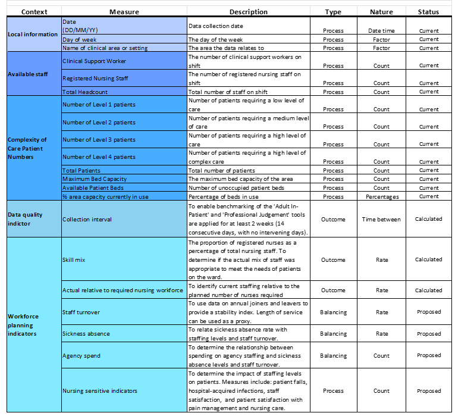

```{r setup, include=FALSE}
knitr::opts_chunk$set(echo = FALSE)
knitr::opts_knit$set(root.dir = 'C:/Users/mberm/OneDrive/Documents/Staffing_levels_for_Nursing_and_Adult_Inpatient_Care_Quality_and_Safety')
```


<br />
<br />

# Scenario

Job applicants, as part of the interview process for the ‘Data and Measurement Advisory’ role with Healthcare Improvement Scotland (HIS), have been asked to analyse staffing levels data across three Clinical areas collected daily by the Senior Charge Nurse and to present and discuss finding at hospital management meeting to discuss safe staffing levels within Hospital X. 
Clinical areas A and B are 25 and 30 bedded adult inpatient wards, respectively. Bed capacity can be over 100% due to admissions/discharges and the opening of surge beds where available.
All data, charts, images, documents and code associated with this exercise can be accessed from [gitHub](https://github.com/MaireadLBermingham/Staffing_levels_for_Nursing_and_Adult_Inpatient_Care_Quality_and_Safety.git).


<br />
<br />

# Aim

## Health and Care (Staffing) (Scotland) Act 2019
The Act was passed by the Scottish Parliament in 2019. Its implementation was paused due to the COVID-19 pandemic. All the provisions within the Act will come into force in April 2024. The Act was passed by Parliament in 2019, but implementation was paused due to the pandemic. All the provisions within the Act will come into force in April 2024.
The aim of the Act is to be an enabler of high-quality care and improved outcomes for service users of health service and care services by ensuring appropriate staffing.


### General duty

The Act places duties on health boards, care service providers, Healthcare Improvement Scotland (HIS), the Care Inspectorate and Scottish Ministers to ensure appropriate staffing. As health professionals, it is our duty to ensuring both appropriate numbers and types of staff as necessary are working as appropriate for:

* health, welling and safety of patients

* and provision of safe and high-quality care

* staff well-being in so far as it impacts the aforementioned conditions

We are also required to submit quarterly Board reports and to publish and submit an annual report to the Scottish Ministers detailing how it has carried out its duties.

Our **aim** is to ensure safe and high-quality care through consistent data collection to scaffold improvement initiatives and facilitate mandatory reporting, maintain the proportion of registered nurses as a percentage of total nursing staff above 65%, and the whole time equivalent (WTE) used meets or exceeds the WTE required to staff the ward.


### DMA data

The data provided as part of the Data and Measurement Advisory job interview process was collected by a Senior Charge Nurse and her line manager and team from Clinical areas, using the Professional Judgement and Adult In-Patient tools. The tools are applied concurrently for at least 2 weeks (14 consecutive days, with no intervening days) [@healthcareimprovementscotland2022AdultInpatientWorkload].


#### The Professional Judgement tool
The Professional Judgement tool facilitates compliance with national recommendations that Senior staff nurses and their line managers should use this tool to determine staffing requirements, supporting evidence-based workforce planning.  


#### Adult In-Patient 
The Adult In-Patient tool supports Senior Charge Nurses and their line managers in making evidence‐based staffing levels decisions by assessing patient dependency and/or acuity and nursing activity.


#### Process measures
#### Measures that indicate that steps we have put in place to achieve our stated aim are being reliably implemented. 
The data provided by the recruitment panel consists of a series of process measures of available staff, and patient care complexity data (Table 1). 


#### Outcome measures
##### Measures that demonstrate or not that we are working toward achieving our stated aim. 
There are no outcome measures included in the DMA data that directly track our progress towards achieving our stated aim of ensuring safe and high-quality care through **consistent data collection** to scaffold improvement initiatives and facilitate mandatory reporting, maintain the **proportion of registered nurses as a percentage of total nursing staff above 65%**, and the **whole time equivalent (WTE) used meets or exceeds the WTE required** to staff the ward.  I have there for used the process measures provided to calculate three outcome measures:  

1. **Collection interval.** To enable benchmarking, the Adult In-Patient and Professional Judgement tools are applied for at least two weeks (14 consecutive days, with no intervening days).

2. **Proportion of registered nurses (RN) as a percentage of total nursing staff.** To determine if the actual mix of staff was appropriate to meet the needs of patients on the ward. The benchmark average on general hospital wards is 65% registered nurses (Table 2) [@royalcollegeofnursingRCNPolicyUnit2006].

3. **Actual relative to required nursing workforce. ** To identify current staffing relative to the planned number of nurses required.   


<br />
<br />

# Updating the DMA Exercise data 
I develop accessible, transparent, time-saving data and measurement handling pipelines, exploratory and downstream analyses and reports in RMarkdown, and use GitHub version control to make it possible for others, including my future self, to collaborate on projects and reproduce results. Many stakeholders are not familiar with R or accessing project folders and documents via GitHub.  I have therefore produced less technical, code-free reports and MS Excel Workbooks as part of my workflow to facilitate collaboration with less technical stakeholders. 


```{r ReadInDAta, echo = FALSE, message = FALSE}
###Reading in the DMA Exercise data
library(tidyverse)
#setting NHS identity colours 
library(NHSRtheme)
palette(get_nhs_colours())
library(readxl)
DMA_data<-read_xlsx("./Data/RawData/DMA Exercise.xlsx", sheet = "Data", skip = 2)
colnames(DMA_data)[1]<-c("Date")
colnames(DMA_data)[2]<-c("Day")
colnames(DMA_data)[3]<-c("ClinicalArea")
colnames(DMA_data)[14]<-c("Activity")
```

Table 3. DMA Exercise data structure.
```{r  DataDescription, message = FALSE}
library(knitr)
kable(str(DMA_data))
```

The data fame included 14 variables and 54 rows. The 'Day of week', 'Total Headcount', 'Total Patients', 'Maximum Bed Capacity', 'Available Patient Beds', and '% area capacity currently in use (Total Patients/Maximum Bed Capacity)' variables are empty and need to be populated.   

## Populating the 'Total Headcount', 'Total Patients', 'Maximum Bed Capacity', 'Available Patient Beds' and '% area capacity currently in use' process measures.
In the 'Scenario tab in the DMA Exercise data MS Excel file, we were informed that Clinical area A is a 25 bedded ward, and
Clinical area B is a 30 bedded ward. Furthermore, we were told that bed capacity can be over 100% due to admissions/discharges and opening of surge beds available. This information was used information to populate the 'Maximum Bed Capacity' variable.


```{r BedCapacity, echo=FALSE, message = FALSE}
DMA_data<-DMA_data %>% 
mutate_at(c('Total Headcount','Clinical Support Worker','Registered Nursing Staff',
           'Total Patients','Number of Level 1 patients','Number of Level 2 patients','Number of Level 3 patients','Number of Level 4 patients',
            'Maximum Bed Capacity','Available Patient Beds','Total Patients'), as.numeric) %>% 
mutate( `Total Headcount` = `Clinical Support Worker` + `Registered Nursing Staff` ) %>% 
mutate( `Total Patients` = `Number of Level 1 patients`  + `Number of Level 2 patients`  +  `Number of Level 3 patients`  +  `Number of Level 4 patients` ) %>% 
mutate( 'Maximum Bed Capacity'  = if_else(ClinicalArea == "A", 25, if_else(ClinicalArea == "B" , 30, NA_real_))) %>% 
mutate( 'Available Patient Beds'  = `Maximum Bed Capacity`-`Total Patients`) %>% 
#We were told in the DMA Exercise data MS Excel file Data sheet that % area capacity currently in use =Total Patients/Maximum Bed Capacity
mutate( `Activity`  =  `Total Patients`/`Maximum Bed Capacity`)

#Renaming `Activity` variable to the original "% area capacity currently in use" descriptor
colnames(DMA_data)[14]<-c("% area capacity currently in use")

head(DMA_data)
```

## Populating the day of the week variable

I use the 'lubricate' package to extract the day of the week from the Date variable. 'Lubridate' is an R package that makes working with dates and times easier. 

### Looking at the consistency of collection across the days of the week

Table 4. Frequency distribution of day of the week by Clinical area.
```{r  WeekDay, message = FALSE}
DMA_data<-DMA_data %>%
  mutate(Day= wday(Date, label = TRUE, week_start = 1)) # (Mon is the first level))
 DMA_data %>%
  group_by(ClinicalArea)  %>% 
  summarise(as_tibble(rbind(summary(Day))))
```
Consistency of collection appears greater in Clinical area B based on the frequency distribution of the day of the week.  There appears at first glance to be a relationship between low days of the week counts in Clinical area A and data collected in Clinical area A. Could it be that the team misassigned the name of the clinical area?

#### Examining the relationship between the dates data was collected in Clinical area C and the other two areas.


```{r  ClinicalAreaCdates, message = FALSE}
#DMA Exercise data for the dates when it was collected in Clinical area C.
DatesToExamineC <- DMA_data %>% filter(ClinicalArea=="C") %>% select(Date)

#Select rows that contain dates when data was collected in Clinical area C
DatesToExamineC_ABC <-  DMA_data %>% filter(Date %in% DatesToExamineC$Date)
#kable(DatesToExamineC_ABC)
```
There is only one of the three dates, 11/1/2023, that you could infer the team may have misassigned the name of Clinical area B with C. Before making this change, I would have to confirm this with the Senior Charge Nurse. For the analyses for the upcoming meeting, I will assume the data has been correctly assassinated to Clinical area C. Data was collected at all three Clinical areas for the other two dates.

  
## Clinical area C 

Ward capacity details were not provided for Clinical area C. As such, the '% area capacity currently in use' measure cannot be calculated. Only Clinical area A and B will be included in downstream analysis, and the last three records in the data set from Clinical area C will be removed. 


```{r  ClinicalareaC_Data, message = FALSE}
# Clinical area C DMA Exercise data.
library(dplyr)
DMA_data<-arrange(DMA_data,  ClinicalArea,Date)
tl<-tail(DMA_data,n=4)
#kable(tl)
#Delete last three  rows
DMA_data <- DMA_data %>% filter(ClinicalArea!="C")
```

## Calculating the 'Collection interval', 'Skill mix' and 'Nurse staffing relative to patient requirements' outcome measures

### Examining the consistency of data collection in Clinical areas A and B.
To determine the consistency of data collection, I calculated the data collection interval.

Table 5. The frequency distribution of Collection interval by Clinical Area.
```{r  ClinicalareaAB_data, echo=FALSE, message = FALSE}
#Populate lagged date by Clinical Area
DMA_dataLag<-DMA_data %>% 
  mutate(Date = as.Date(Date)) %>%
  select(ClinicalArea,Date) %>%
  arrange(ClinicalArea, Date) %>% 
  group_by(ClinicalArea) %>%
  mutate(lag1_Date = lag(Date, n=1)) %>%
  mutate(lag1_ClinicalArea = lag(ClinicalArea, n=1)) %>%
  mutate(lag1_Date=ifelse(ClinicalArea == "A" & lag1_ClinicalArea == "B", NA, lag1_Date))  %>% 
  # Apply filter & is.na to remove rows with lag1_Date==NA
  filter(!is.na(lag1_Date)) %>%
  mutate(lag1_Date = as.Date(lag1_Date)) %>%
  ## Calculate the number of days between collection dates.
  mutate(CollectionInterval = as.numeric(difftime(ymd(Date), 
         ymd(lag1_Date), units = "days")))
#nrow(DMA_data)
#51
#nrow(DMA_dataLag)
#49
DMA_data<-DMA_data %>% left_join(DMA_dataLag)
#nrow(DMA_data)
#51

#Calculate frequency and percentage of Collection interval, grouped by Clinical Area

require(knitr)
require(formattable)
FT<-DMA_data %>%
  filter(!is.na(lag1_Date)) %>%
  group_by(ClinicalArea, CollectionInterval) %>%
  summarise(Frequency = n()) %>%
  mutate(Percent= percent((Frequency / sum(Frequency))))
kable(FT, col.names = c("Clinical area","Collection interval","Frequency","Percent"))
#Remove the redundant table
rm(FT)

```

The consistency of data collection was much higher in Clinical area B, compared to A. In total, 89% of records were collected within one day, as opposed to 68% in clinical area C.


## Calculating the 'Skill mix' and ‘Nurse staffing relative to patient requirements’ outcome variables

Skill mix was simply calculated as the rate of Registered nursing staff to total nursing staff. 
The total daily required establishment, WTE was calculated as:


Using general ward multipliers for level 1-4 patients [@griffiths2020SaferNursingCare]. 

```{r OutcomeMeasures, echo=FALSE, message = FALSE}
colnames(DMA_data)[5]<-c("RegisteredNursingStaff")
colnames(DMA_data)[6]<-c("TotalHeadcount")
DMA_data<-DMA_data %>% 
mutate(Skillmix = round(RegisteredNursingStaff/TotalHeadcount,4))  %>% 
#Assuming all nurses are working a 37.5 hour week
mutate(ActualWTE=(37.5/7)*TotalHeadcount) %>% 
mutate(RequiredWTE=0.99*(`Number of Level 1 patients`)+1.39*(`Number of Level 2 patients`)+1.72*(`Number of Level 3 patients`)+1.97*(`Number of Level 4 patients`))%>%  
mutate(ActualRelativeToRequiredNursingWorkforce=round(ActualWTE/RequiredWTE,4)) 
#table(summary(DMA_data[, c()]))

```

## Checking for missing records and removing redundant variables
```{r MissingData , echo=FALSE, message = FALSE, warning=FALSE}
DMA_data %>% 
  select_if(function(x) any(is.na(x))) %>% 
  summarise_each(funs(sum(is.na(.)))) -> DMA_data_NA
kable(DMA_data_NA)
# Replace NAs in the Collection Interval measure
DMA_data<-DMA_data %>% 
  mutate(CollectionInterval = replace_na(CollectionInterval, 0)) %>% 
  select(-c(lag1_Date,lag1_ClinicalArea,ActualWTE,RequiredWTE))
```
The data is complete, the only missing records are those associated with the 'Collection interval' measure. I have set those missing records to zero and removed redundant variables.


<br />
<br />

## Adding the updated data to the DMA Exercise data Excel file
The original DMA Exercise data Excel file was read in again, and a working DMA Exercise working data Excel file was set up in the project output data folder to collect data updates, summary tables, charts, results and comments for stakeholders to review prior to the Hospital X management meeting.

```{r AddUdatedDMAdata, echo = FALSE, message = FALSE, warning=FALSE}
library(tidyverse)
library(openxlsx)
wb <- loadWorkbook("./Data/RawData/DMA Exercise.xlsx")
addWorksheet(wb, "Updated data", gridLines=FALSE)
writeData(wb, "Updated data", DMA_data)

#Add the data
writeData(wb,"Updated data",DMA_data, startCol = 1, startRow = 1, rowNames = FALSE)
setColWidths(wb, "Updated data", cols=1:17, widths=21)

#Add the table header style
headerStyle<-createStyle(
 fontName="Calibri",
  fontSize=11,
 textDecoration="bold",
  fontColour= "#000000",
  halign="center",
  borderColour="#000000",
)
addStyle(wb, sheet="Updated data", headerStyle , rows=1, cols=1:17, gridExpand=TRUE) 

#Add the table body style
BodyStyle<-createStyle(
fontName="Calibri",
fontSize=11,
border="TopBottomLeftRight",
borderColour="#000000")
addStyle(wb, sheet="Updated data",BodyStyle , rows=2:52, cols=1:17, gridExpand=TRUE) 

#Saving the workbook
saveWorkbook(wb,"./Output/Data/DMAExercise_workings.xlsx",overwrite = T)

```


# Visual representation of the three calculated outcome variables

## Run charts

Run charts were used to plot the DMA exercise data over time to observe trends, patterns, and variation in three outcome measures and to study the effect of your improvement efforts. The primary purpose of run charts is to identify non-random variation resulting from real change [@anhoj2014RunChartsRevisited].

```{r Runcharts, echo=FALSE, message = FALSE}
# Load the qicharts2 package
library(qicharts2)
library(gridExtra)
# Create a 3x 2 plotting matrix
par(mfrow = c(3, 2)) 
# The next 6 plots created will be plotted next to each other

# Lock random number generator to make reproducible results.
set.seed(2)
head<-"Visual representation of the three new outcome variables"

#Subletting the data by clinical area
DMA_dataA <- DMA_data %>% filter(ClinicalArea=="A")
DMA_dataB <- DMA_data %>% filter(ClinicalArea=="B")
#nrow(DMA_dataA)
#23
#nrow(DMA_dataB)
#28
```

We have 23 and 28 data points in Clinical areas A and B, respectively. This means the lower limit for the number of runs are seven and ten, and the upper limit is 17 and 20 runs to demonstrate non-random variance attributable to changes in staffing levels.

### Run chart of Collection interval for Clinical area A

Figure 1a. Run chart of Collection interval for Clinical area A. The run chart is a plot of Collection interval for Clinical area A over time. The horizontal line is the median, which divides the data points in two halves. The green line represents the established benchmark for the measurement.

```{r CIAA_Runchart, echo=FALSE, message = FALSE}

# Plot Run chart of Collection interval for Clinical area A
CollectionintervalA<- qic(CollectionInterval, x=Date, 
    data  = DMA_dataA,title = NULL,
    ylab  = 'Collection interval (days)',
    xlab  = 'Date',
    point.size = 1.6, target=1, decimals=1)
print(CollectionintervalA)
```

The collection interval for Clinical area A was inconsistent. No shifts or trends were seen on the run chart. The median was one, it was therefore not possible to assess the number of runs. However, an astronomical point of three days was measured on Saturday, the 14th of January 2023.

### Run chart of Collection interval for Clinical area B

Figure 1b. Run chart of Collection interval for Clinical area B. The run chart is a plot of Collection interval for Clinical area B over time. The horizontal line is the median, which divides the data points in two halves. The green line represents the established benchmark for the measurement.

```{r CIAB_Runchart, echo=FALSE, message = FALSE}

# Plot Run chart of Collection interval for Clinical area B
CollectionintervalB<-qic(CollectionInterval, x=Date, 
    data  = DMA_dataB,title = NULL,
    ylab  = 'Collection interval (days)',
    xlab  = 'Date',
    point.size = 1.6, target=1, decimals=1)
print(CollectionintervalB)
```

The collection interval for Clinical area B was more consistent, only missing three sample dates. No shifts or trends were seen on the run chart. Six runs can be seen on the run chant, which is below the lower limit of 10, suggesting statistically significant change.


### Run chart of Skill mix for Clinical area A

Figure 1c. Run chart of Skill mix for Clinical area A. The run chart is a plot of Skill mix for Clinical area A over time. The horizontal line is the median, which divides the data points in two halves. The green line represents the established benchmark for the measurement.

```{r SMAA_Runchart, echo=FALSE, message = FALSE}

# Plot Run chart of Skill mix for Clinical area A
SkillmixA<- qic(Skillmix, x=Date, 
    data  = DMA_dataA,title = NULL,
    ylab  = 'Skill mix',
    xlab  = 'Date',
    point.size = 1.6, target=0.65, decimals=2)
print(SkillmixA)

```

The Skill mix for Clinical area A was low and variable and only exceeded the benchmark of 0.65 on Thursday, the 19th of January 2023. No shifts or trends were seen on the run chart. Thirteen runs can be seen on the run chant, which is below the upper limit of 17, suggesting no statistically significant change. However, an astronomical point of .33 was measured on Sunday, the 22nd of January, 2023.


### Run chart of Skill mix for Clinical area B

Figure 1d. Run chart of Skill mix for Clinical area B. The run chart is a plot of Skill mix for Clinical area B over time. The horizontal line is the median, which divides the data points in two halves. The green line represents the established benchmark for the measurement.

```{r SMAB_Runchart, echo=FALSE, message = FALSE}

# Plot Run chart of Skill mix for Clinical area B
SkillmixB<-qic(Skillmix, x=Date, 
    data  = DMA_dataB,title = NULL,
    ylab  = 'Skill mix',
    xlab  = 'Date',
    point.size = 1.6,  target=0.65, decimals=2)
print(SkillmixB)
```

The Skill mix for Clinical area B was also low and variable and exceeded the benchmark of 0.65 with two astronomical points on Thursday, the 12th and 19th of January 2023. Clinical area A also exceeded the benchmark on the 19th of January, 2023. It was interesting to hear what insights Senior Charge Nurse has as to why performance improved dramatically at the two Clinical areas on that date. No shifts or trends were seen on the run chart. Eighteen runs can be seen on the run chant, which is below the upper limit of 20, suggesting no statistically significant change. However, an astronomical point of .33 was measured on Sunday, the 29th of January, 2023.


### Run chart of Actual relative to required nursing workforce for Clinical area A

Figure 1e. Run chart of Actual relative to required nursing workforce for Clinical area A. The run chart is a plot of Actual relative to required nursing workforce for Clinical area A over time. The horizontal line is the median, which divides the data points in two halves. The green line represents the established benchmark for the measurement.

```{r WLAA_Runchart, echo=FALSE, message = FALSE}
# Plot Run chart of Actual relative to required nursing workforce for Clinical area A
WorkforceA<- qic(ActualRelativeToRequiredNursingWorkforce, x=Date, 
    data  = DMA_dataA,title = NULL,
    ylab  = 'Actual relative to required nursing workforce',
    xlab  = 'Date',
    point.size = 1.6, target=1, decimals=2)
print(WorkforceA)
```

The Actual relative to required nursing workforce for Clinical area A fell below our set benchmark of one on six occasions.  No shifts or trends were seen on the run chart. Eleven runs can be seen on the run chant, which is below the upper limit of 20, suggesting no statistically significant change. However, an astronomical point of 1.62 was measured on Sunday, the 22nd of January, 2023.


### Run chart of Actual relative to required nursing workforce for Clinical area B

Figure 1f. Run chart of Actual relative to required nursing workforce for Clinical area B. The run chart is a plot of Actual relative to required nursing workforce for Clinical area B over time. The horizontal line is the median, which divides the data points in two halves. The green line represents the established benchmark for the measurement.  

```{r WLAB_Runchart, echo=FALSE, message = FALSE}
# Plot Run chart of Actual relative to required nursing workforce for Clinical area B
WorkforceB<- qic(ActualRelativeToRequiredNursingWorkforce, x=Date, 
    data  = DMA_dataB,title = NULL,
    ylab  = 'Actual relative to required nursing workforce',
    xlab  = 'Date',
    point.size = 1.6, target=1, decimals=2)
print(WorkforceB)
```

The Actual relative to required nursing workforce for Clinical area B fell below our set benchmark of one on nine occasions.  No shifts or trends were seen on the run chart. Eleven runs can be seen on the run chant, which is above the lower limit of 10, suggesting no statistically significant change. However, astronomical points of 1.79 and 1.76 were measured on Monday the 9th and Sunday the 29th of January 2023. Another astronomical point of 0.65 was measured on Tuesday, the 31st of January, 2023.


# Bean plots

Although, for the most part, the three outcome measures have exhibited random variation, i.e., variation not related due to any staffing improvements you have introduced. Nonetheless, random variation is driven by chance events that affect operational processes, people and patient outcomes equally and may potentially provide insights into performance gaps and areas that need improvement.

As such, bean plots were used to compare variation in the outcome variables between Clinical areas A and B and the day of the week. The primary purpose of run charts is to visually represent and compare variation across categorical groups [@kampstra2022PackageBeanplot].

## Bean plot of the variation in Skill mix across Clinical areas A and B

I could not compare the variation in Skill mix by Clinical areas A and B across the day of the week. The measurement within the two Clinical areas was too sparse to compare across the day of the week. I, therefore, compared the variation in Skill mix across Clinical areas A and B, then combined the data for the two Clinical areas and compared the variation in Skill mix across the day of the week.

Figure 2a. Bean plot of the variation in Skill mix across Clinical areas A and B. The Bean plot is a plot comparing Skill mix variation across Clinical areas A and B. Black horizontal thick lines of each bean plot indicate the category median of the measurement. The broken black horizontal line is the across-category median of the measurement. The short and thin black horizontal lines within each bean plot represent each measure value. Most of the measure values lie in the area where the bean plot is widest. The green line represents the established benchmark for the measurement. 

```{r SMAAB_Bean plot, echo=FALSE, message = FALSE}
#Load the beanplot package
library(beanplot)
# Plot Bean plot of Skill mix across Clinical areas A and B
 
beanplot(Skillmix ~ ClinicalArea, data = DMA_data, ll = 0.04, ylab = "Skill mix", col = list("#003087", "#003087"),  beanlines = "median",overallline= "median")
abline(h=0.65, col="#009639")
```

The weight of the variance in skill mix is below the recommended threshold of 0.65 in both Clinical areas. Clinical area A slightly outperforms Clinical area B, having a greater portion of measurement values above the combined median of the two Clinical areas.    


## Bean plot of the variation in Skill mix from Clinical areas A and B across the day of the week. 

Figure 2b. Bean plot of the variation in Skill mix from Clinical areas A and B across the day of the week. The Bean plot is a plot comparing Skill mix variation from Clinical areas A and B across the day of the week. Black horizontal thick lines of each bean plot indicate the category median of the measurement. The broken black horizontal line is the across-category median of the measurement. The short and thin black horizontal lines within each bean plot represent each measure value. Most of the measure values lie in the area where the bean plot is widest. The green line represents the established benchmark for the measurement. 
```{r SMAAB_ByWeek_Bean plot, echo=FALSE, message = FALSE}
# Plot Bean plot of Skill mix from Clinical areas A and B across the  day of the week
beanplot(Skillmix ~ Day, data = DMA_data, ll = 0.04, ylab = "Skill mix", col = list("#003087", "#003087"), beanlines = "median", overallline= "median")
abline(h=0.65, col="#009639")
```

The weight of the variance in skill mix from Clinical areas A and B across the day of the week was below the established threshold of 0.65. Only on Thursdays was the weight of the variance in skill mix from Clinical areas A and B above the threshold.  Maintaining the recommended skill mix appears to be particularly problematic on Wednesdays, Fridays and Sundays.
 
## Bean plot of the variation in Actual relative to required nursing workforce by Clinical areas A and B across the day of the week. 
Figure 2c. Bean plot of the variation in Actual relative to required nursing workforce by Clinical areas A and B across the day of the week. The Bean plot is a plot comparing variation in Actual relative to required nursing workforce by Clinical areas A and B across the day of the week. Black horizontal thick lines of each bean plot indicate the category median of the measurement. The broken black horizontal line is the across-category median of the measurement. The short and thin, black and white horizontal lines within each bean plot represent each measure value. Most of the measure values lie in the area where the bean plot is widest. The green line represents the established benchmark for the measurement. 

```{r WFAAB_ByWeek_Bean plot, echo=FALSE, message = FALSE}
# Plot Bean plot of the variation in Actual relative to required nursing workforce by Clinical areas A and B across the day of the week
beanplot(ActualRelativeToRequiredNursingWorkforce ~ ClinicalArea*Day, data = DMA_data, ll = 0.04, ylab = "Actual relative to required nursing workforce",  side = "both", col = list("#003087", c("#41B6E6", "white")), beanlines = "median",overallline= "median")
abline(h=1, col="#009639")
legend("bottomleft", fill =c("#003087", "#41B6E6"), legend = c("A", "B"),cex=0.65)
```

The weight of the variance in skill mix from Clinical areas A and B across the day of the week was below the established threshold of 0.65. Only on Thursdays was the weight of the variance in skill mix from Clinical areas A and B above the threshold. Maintaining the recommended skill mix appears to be particularly problematic on Wednesdays, Fridays and Sundays.
 

# Pareto chart

The day of the week appears to have an impact on all three outcome measures. To concentrate improvement efforts, we need to determine the days of the week that have the greatest impact.

The Pareto chart is a graphic depiction of the Pareto principle, a theory maintaining that; approximately 80% of causes of any problem come from 20% of causes. And, if we focus on the most critical few causes (20%), we will solve most (80%) of the total problems. The Pareto chart's primary purpose is to identify the few important causes of an event from the less significant ones, as most organisational problems result from a few causes. Using a Pareto Chart helps service teams to prioritise improvement efforts on the factors that have the greatest impact [@olaitan2023QualityImprovementUrological].

As such, we used the Pareto Chart to help identify the days of the week that impact the staffing level outcome measures most. 

Figure 3. Pareto chart of the day of the week. The Pareto chart is a plot containing a bar plot where the days of the week are arranged in descending order, and the cumulative total is represented by the line. The y-axis shows the frequency of factors. The chart enables healthcare service teams to assess which causes the largest proportion of problems and prioritise the factors that will make the most significant improvements. An 80% is the cut-off used to indicate where the 80/20 rule applies, i.e., the critical few factors that warrant the most attention sit under the 80% cut-off line.


```{r Paretochart_ByWeek, echo=FALSE, message = FALSE}
#Load the  qcc package
library(qcc)
# Plot  Pareto chart of weekday
paretochart(DMA_data$Day,  title  = NULL)
```

Records collected on Mondays, Sundays, Tuesdays, Saturdays and Fridays account for 80% of records collected. The fewest records were collected on Wednesdays and Thursdays. We need to consider the reasons for this at the management meeting this week so we can focus our efforts on these causes to make the biggest impact in terms of improved staffing levels.


# Findings 
Other than eight astronomical points across the three outcome measures across Clinical area A and B, which warrant further scrutiny. No other evidence of non-random variance was attributable to changes in staffing levels observed in the data. 
Skill mix appears to be independent of Actual relative to the required nursing workforce (Table 6). Poor skill mix appears most problematic on Sundays. As expected, there appears to be a relationship between Actual relative to the required nursing workforce and consistency of data collection, both appeared to be most problematic on Sundays.

Previous research has shown that, on average, acute patients admitted to hospital emergency departments on a weekend experience worse outcomes than those admitted on a weekday [@honeyford2018WeekendEffectDoes]. Nevertheless, why the day of the week affects the outcome measures remains unclear. Factors contributing to the day of the week effects as such warrant consideration.


# Considerations

Now that we have reviewed the data, we need to work together to consider redesigning our improvement plan based on the evidence presented in this report.

## Questions to inform your improvement plan. 
I would be very grateful if could consider these five questions before joining the Hospital X management meeting this week:

1.	Have the three records in Clinical area C been misassigned? 
  + If so, will it be possible to reassign them to the correct Clinical area?
  
2. What contingencies can we put in place to ensure data is collected daily, particularly on Wednesdays and Thursdays?

3. What factors do we need to consider to move the Skill mix toward the recommended benchmark of 0.65?

4. What contingencies can we put in place to ensure the whole time equivalent (WTE) used meets or exceeds the WTE required to staff the ward, particularly on Tuesdays and Thursdays?

5. Can you explain the cause of the astronomical points across the three outcome measures in Clinical areas A and B?


## Adult inpatient care journey

Let us consider the Adult inpatient care journey. First, the patient will be referred by a GP or Accident and emergency service and will be admitted from outpatients or theatre to the inpatient ward.  A nurse will then look after them and manage their pain. During their stay, a patient will be cared for by a multidisciplinary healthcare team, which includes doctors, nurses, healthcare assistants and others. Nursing staff on the ward will be working to a planned date for their discharge home or into community care (Figure 4).


### The nursing process
The nursing process is a methodical problem-solving approach used to identify, prevent and treat actual or potential health issues and promote well-being. It has five steps: assessment, diagnosis, planning, implementation and evaluation (Figure 5) [@semachew2018ImplementationNursingProcess]. 


#### DMA data
After considering the Adult inpatient care journey, What measures do we need to start collecting in the future that can reliably demonstrate that we are making strides towards achieving our stated aim of ensuring safe and high-quality care through consistent data collection to scaffold improvement initiatives, and facilitating mandatory reporting, maintain the proportion of registered nurses as a percentage of total nursing staff above 65%, and the whole time equivalent (WTE) used meets or exceeds the WTE required to staff the ward?


##### Process measures
###### Measures that indicate that steps we have put in place to achieve our stated aim are being reliably implemented. 
The data provided by the recruitment panel consists of a series of process measures of available staff, and patient care complexity data (Table 1).

###### Measures of nursing care quality and performance
However, the DMA data does not include nursing care quality and performance measures from across the Nursing process (Figure 5). I would like to propose that we should consider making use of routinely collected nursing-sensitive indicators to determine whether nursing care quality and performance have an impact on patient outcomes (Table 7) [@oner2021NursingSensitiveIndicators].



##### Balancing measures
###### Measures that track improvements in one part of the system to ensure they are causing unintended consequences elsewhere in the system.
We now need to consider the system from different directions and ensure that any implemented staffing improvements do not cause problems in other parts of the system. I would like to propose that we should consider making use of routinely collected staff turnover, sickness absence and agency spending balancing measures to reflect what may be happening elsewhere in the system because of the staffing improvements in the adult inpatient ward (Table 7) [@ball2010GuidanceSafeNurse].

## Cause and effect analysis
The review of the DMA exercise data has highlighted several factors impacting the provision of safe and high-quality care.  I now propose using a structured cause-and-effect analysis approach to utilise our collective knowledge to help identify and agree on the root causes of unsafe and poor-quality care and what measures should be collected for further study.
The Fishbone diagram (also called Ishikawa diagrams or Cause-and-effect diagram diagrams) is a visualisation tool used to identify root causes of quality problems. The fishbone diagram is primarily used to find the causes of problems [@abdulai2020FishboneAnalysisUse].

![Figure 6. Draft Fishbone diagram of factors affecting the provision of safe, high-quality care in adult inpatient wards. The Fishbone diagram depicts the multiple factors affecting the provision of safe, high-quality care. The diagram looks much like the skeleton of a fish and summarises potential causes for a problem by sorting possible causes into categories. The horizontal arrow, the ʺspineʺ of the fish, points to the problem. The 45-degree angle lines (ʺbonesʺ) from the arrow (“spine of the fish”) represent each of the main causes.](./../../Output/Visuals/FishboneDiagram.png)


```{r Ishikawadiagram, echo=FALSE, message = FALSE}
## Plot the Fishbone diagram for Safe and high-quality care
## Load the qcc package
#library(qcc)
#cause.and.effect(cause=list(
#                          Measurements=c("Day of the Week", "Clinical area", "Data consistency", "Skill mix", "Workforce" ,"Staff turnover", "Sickness absence", "Agency spend", "Patient #falls", "Hospital infections", "Staff satisfaction", "Patient satisfaction"),
#                            Staff=c("Shifts", "Managers", "Training"),
#                            Patients=c("Acuity", "Dependency", "Age", "Sex", "Socioeconomic status"),
#                            Processes=c("Assessment", "Diagnosis", "Planning", "Implementation", "Evaluation", "Data collection"), Environment=c("Health and Care (Staffing) (Scotland) Act #2019")), effect="Provision of safe and high-quality care", title="Fishbone diagram for Safe and high-quality care")
```


The draft Fishbone diagram above (Figure 6) has shown that the main causes of unsafe and poor-quality care relate to measurements, staff, patients, process and the environment. For each of the five main causes, the potential factors that can impact the provision of safe and high-quality care are summarised in the diagram.

At the end of the presentation, we will undertake a cause-and-effect analysis, using the draft Fishbone diagram shown above as our starting point to consolidate our collective knowledge of and gain a shared insight into factors that affect safe and high-quality care provision. 

Please consider any other cause-and-effect factors that have been omitted and how they interrelate to those already included on the diagram and be prepared to discuss them and be ready to revise and co-design the Fishbone diagram during the hospital management meeting this week.


# References